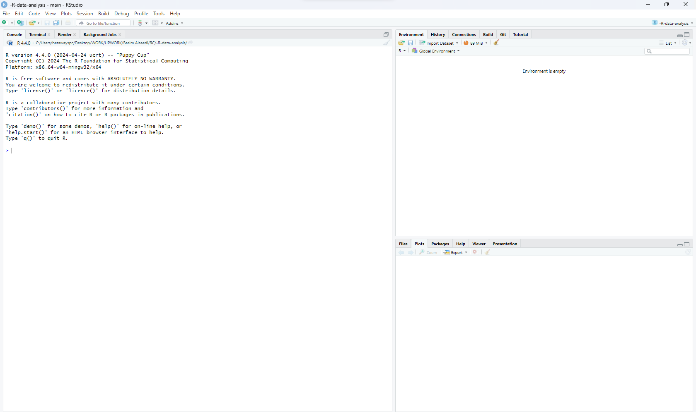

# Introduction

## Purpose of this Book

-   **To Master Descriptive Statistics**: Teach readers how to summarize and describe essential features of data effectively, enabling a deeper understanding of datasets.
-   **To Equip Readers with Hypothesis Testing Skills**: Provide a solid foundation in conducting and interpreting various statistical tests, including Chi-Square, t-tests, z-tests, and non-parametric tests, crucial for making informed decisions based on data.
-   **To Introduce ANOVA and F-tests**: Guide readers through the process of analyzing variance among group means with the ANOVA technique and explain the importance of F-tests in comparing statistical models.
-   **To Explore Regression Analysis**: Offer comprehensive insights into Ordinary Least Squares (OLS) and Multiple Linear Regression (MLR), essential tools for modeling and predicting continuous outcomes.
-   **To Understand Categorical Data Analysis**: Provide the basics of analyzing categorical data using simple logistic regression, essential for situations where response variables are categorical.

## Overview of R and the RStudio Interface

R is a programming language and free software environment for statistical computing and graphics supported by the R Foundation for Statistical Computing. It is widely used among statisticians and data miners for developing statistical software and data analysis.

To install R, visit CRAN (Comprehensive R Archive Network) at [cran.r-project.org](https://cran.r-project.org/), select your operating system, and follow the provided installation instructions. After installing R, download RStudio, a popular IDE for R, from [rstudio.com](https://www.rstudio.com/products/rstudio/download/), choosing the appropriate installer for your OS.

R is the actual programming language used for statistical analysis and graphics, while RStudio provides an integrated development environment to write R code and visualize its outputs more conveniently. RStudio enhances R's user experience with features like syntax highlighting, direct code execution, and graphical representation but requires R to be installed first.

### Navigating RStudio: Panels, Scripts, Console, and Environment

RStudio is an Integrated Development Environment (IDE) for R. It includes a console, a syntax-highlighting editor that supports direct code execution, as well as tools for plotting, history, debugging, and workspace management.

Here are demonstrations on how R works:

```{r navigation-RStudio1, echo=TRUE, message=FALSE, warning=FALSE}
# Simple code to demonstrate the console output with the built-in 'cars' dataset
summary(cars)
```

```{r navigation-RStudio2, echo=TRUE, message=FALSE, warning=FALSE}
# Basic data visualization in the Plots panel
plot(cars$speed, cars$dist, main = "Stopping Distances vs Speed")
```

```{r navigation-RStudio3, echo=TRUE, message=FALSE, warning=FALSE, eval=TRUE}
# Using the Help panel to access documentation
?summary
```

```{r navigation-RStudio4, echo=TRUE, message=FALSE, warning=FALSE}

# a simple function and viewing it in the Source panel
# ideal for reusing the same code
my_mean_function <- function(x) {
  sum(x) / length(x)
}
my_mean_function(cars$speed)

# TODO: add screenshots and diagrams to visually guide through the RStudio interface.
```

Each of these code chunks illustrates a different aspect of RStudio:

1.  **Basic data visualization**: Introduces us to R's plotting capabilities, which will display in the Plots panel of RStudio.
2.  **Accessing documentation**: Shows how to use the Help system in RStudio, demonstrating how to find information on specific functions.
3.  **Writing a function**: Encourages users to practice scripting in the Source panel and understand the concept of function creation in R.

### RStudio Projects and Workspace Management

RStudio projects make managing your R work much easier. They allow you to encapsulate all of the materials for a single analysis in one place, simplifying paths and workspace management.

```{r RStudio-projects, eval=FALSE}
# This is only a demonstration.
# To create a new project:
# - Click on 'File' -> 'New Project...'
# - Follow the prompts to set up a new project
```

### Installing and Managing Packages

R’s functionality is divided into a number of packages, which are free libraries of code written by R's active user community. This is how we install a package, and then load it into our environment, so as to use it throughout our session:

```{r install-packages, eval=FALSE}
# Example code to install and load a package
install.packages("tidyverse")
library(tidyverse)
```



## Importance of Data Analysis with R

### Role of Data Analysis in Modern Industries

Data analysis isn’t just crunching numbers; it’s about telling stories and making informed decisions. In modern industries, it guides everything from predicting market trends to optimizing supply chains. With R, you're not just learning a programming language, but gaining a key to unlock these data-driven narratives.

### Case Studies of R in Action

Imagine a company figuring out what makes a marketing campaign successful or a scientist discovering a groundbreaking way to save endangered species—all with the help of R. These real-world successes aren't just stories; they're blueprints for what you can accomplish with data analysis in R.

### R's Ecosystem and Community

Joining R is like moving into a friendly neighborhood. There’s always someone to lend you a hand—whether it's through forums, user groups, or conferences. And with an ever-growing collection of packages, R is like a toolbox that's constantly being filled with new, shiny tools.

### Future Trends in Data Analysis with R

Data analysis with R is like having a crystal ball; it helps predict future trends, from advancements in AI and machine learning to big data's expanding role. As you dive into R, you’re not just keeping up—you’re riding the wave of the data revolution.

------------------------------------------------------------------------

## Exercises

**1. Get to know RStudio.** - Open RStudio and identify each of the four main panels.

**2. Create your first RStudio project.** - Use the RStudio interface to start a new project in a new directory.

**3. Install and load a package.** - Install the `dplyr` and `tidyverse` packages and load them using `library()`.

``` r
# TODO: Insert Exercise chunk with error messages and solutions.
```
